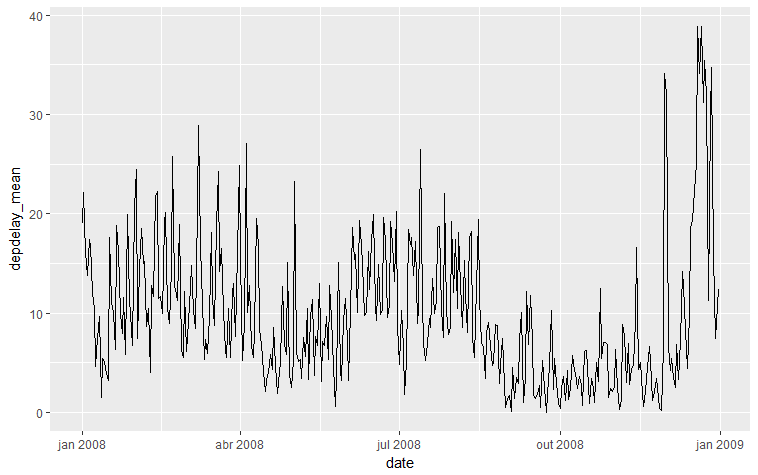
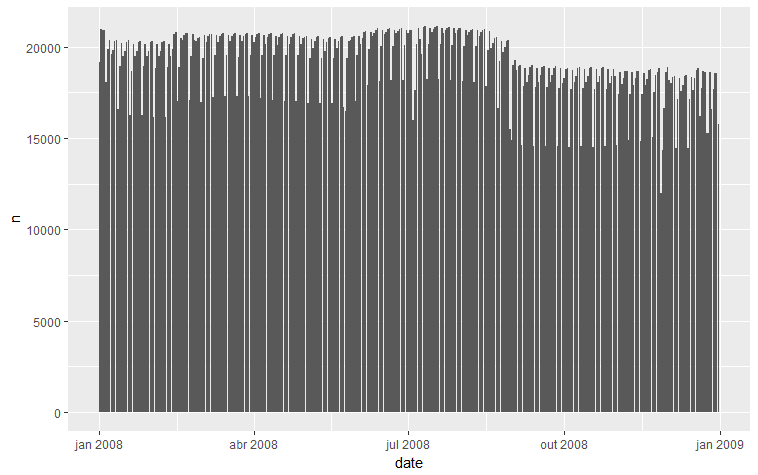
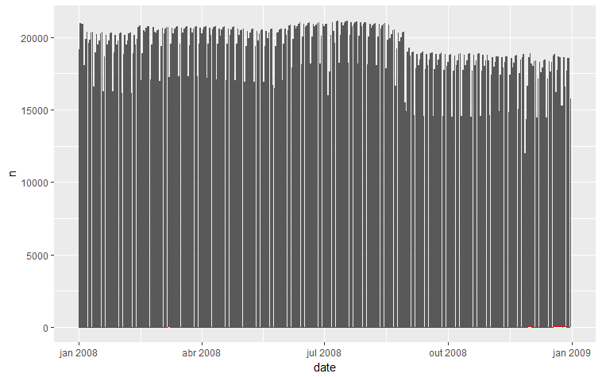
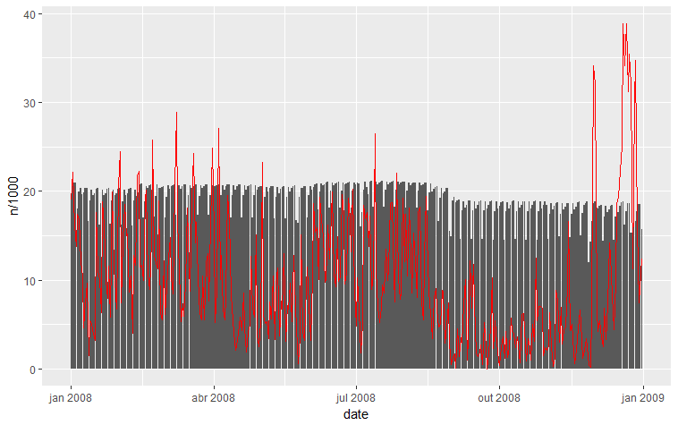
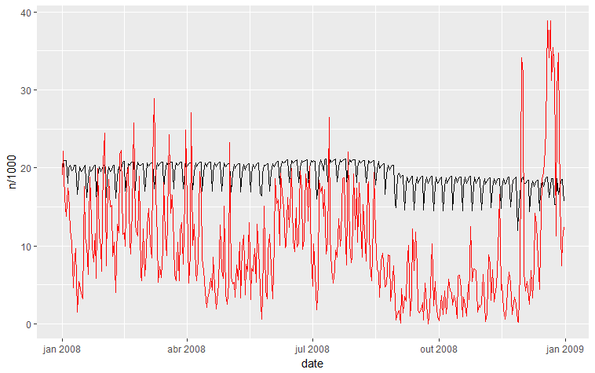

# Summary

This visualization presents the 2008 United States flights count and average departure delay by day. The flight volume has a frequency of one week, peaking usually on friday and dipping on saturday. Occasionally holidays affects this pattern. Departure delays are usually higher on high flight number days but also could be affected by weather or other specific situation.

# Design

To represent the data, I choosed a line chart because the idea was to compare flights delay over time. To allow comparison between the number of flights and delay, it was used 2 y-axis. One on the left side, with the departure delay in minutes scale and one on the right side, with the number of flights scale. This approach allowed me to plot two lines with different scales on the same graph.

I've enabled gridlines with low saturation color and thin lines for better comparison between points over time. The axis labels were enlarged to better reference, but without any bold effect to not distract the reader. I used color to distinct the two lines plotted (one for number of flights and the other for flight delay). The main message from the graph was the fligh delay distribution across 2008, so I've opted to color this line plain black. Black is objective, without major distractions and clear for the reader. The second information presented on the graph was the number of flights. It was choosen to enable the reader to compare with delays and to understand the distribution across the year. For this line, I used light grey. This choice enable the coexistence of the two lines on the graph without stealing the reader's attention from the main line.

It was added a label on the top right of the graph to differentiate the lines. Also, a clear title and subtitle were written to conduct the reader to the message and findings of the graph.

Important events along the year that could have affected number of flights and delays were added to the graph to help the reader to assess and compare this information with the delays and flight numbers.

The library used to code the graph, dimple.js, has an builtin feature that allows reader interaction on the graph. Hovering the mouse on the line presents the detail of that point and marks the x and y axis positions. This feature is very handy to the reader get the detail of a specific day, and compare the peaks of number of flights and delays.

After feedbacks I've updated the graph with the following features:

* Red thin mean lines representing the overall mean for the year. To be clear on the visualization, near the y-axis was included a note for the mean line with the value and on the graph label a little description of the mean line.

* Footnote of the source of the data presented.

* Custom interactive tool tips box with better labels and the day of the week.

Initial design decisions where prototyped on R, with these results:

Delay over time (line):

Number of flights over time (bar):

Number of flights and delay over time (line + bar):

Number of flights scaled and delay over time (line + bar):

Number of flights scaled and delay over time (line + line):

# Feedback

### [Version 1](http://bl.ocks.org/vitorbellini/c8e88e2bfb075d6f79ce1ac9939932e1)

### Person 1

*"I realized that I was wanting to carry out a study of trends between periods and time of delay. Featuring a very large oscillation.*

*I think that the graph should show the mean of the delay that is being sought or a point of reference for analyzing and evaluating the variations, and studying the causes, being the basis for decision making, in the search for the reach of the "midpoint". Without this information I can not understand what we should evaluate and propose corrective measures. Or is it just to give a "picture" of the situation?*

*I saw that there are some periods that have a very similar delay time behavior. But it also has periods with very "off-trend" spikes both up and down, very sharp, that do not repeat themselves, that is, they do not form a trend. This would be related to period of high / low season or weather or ...?*

*I do not understand why the graph is contemplating along with the month the day of the week, does this have any purpose in terms of evaluation?*

*In fact, I think a graph has to have a "clear visual" way to communicate what we want to evaluate and presents the variables in their axes. I also think it should have a caption."*

### Person 2

* **What did you realised on the visualization?**

*Average information graph of late flight takeoff in the US throughout 2008*

* **What questions do you have about the data?**

*None.*

* **What relationships did you noticed?**

*That there are days with a higher average of delay, that the average delay was lower from September to November, and that the Christmas holiday registers the biggest delays.*

* **What do you think is the main highlight on the visualization?**

*The significant variation of average delay between days, represented in the various peaks and valleys.*

* **Is there something you do not understand in the chart?**

*No.*

### Person 3

* **What did you realised on the visualization?**

*Large oscillation in frequency*

* **What questions do you have about the data?**

*What events occurred at the maximum and minimum points? What period of time did it occur? What is the reason of always after a high has the least? or vice versa*

* **What relationships did you noticed?**

*"High vs low" distribution shows instability, in case I can think that it was a period of bad weather conditions.*

* **What do you think is the main highlight on the visualization?**

*Not visible horizontal line, is it time? does not indicate the units of measurement?*

**Note:** Later on I've noticed that firefox browser was cutting part of the graph.

* **Is there something you do not understand in the chart?**

*Axis with the units will be easier to understand.*

**Note:** Later on I've noticed that firefox browser was cutting part of the graph.

* **Other comments**

*What is the source of the data?*

### [Version 4](http://bl.ocks.org/vitorbellini/0aadf21fabea23166f1ede52351ee2f1)

### Person 1

*"The graph want to make a relationship with two variables that are the delay time and the number of flights, considering some facts in time such as summer vacation, financial crisis, christmas. But, there is no identification of the others. I think it should have even in "normal periods". It gives the feeling of something "missing", even because there is no legend.*

*In this type of chart, which item do you consider the most relevant? I think it's the number of flights because it's at the top. Hence, I think that in the axes, as the tendency of our intuition is start reading on the left side, there could be an inversion, ie on the left side the number of flights and the right side the time delay.*

*I also wondered if for a better view that "horizontal lines" graph would be better, in which you would have the direct visualization of number of flights and time of delay.*

*I have seen that it has a tendency of when decreasing the number of flights increases the delay time. But in some periods this tendency is not repeated. There may also be some need for adjustment in the graph because when you position the lines, in some periods, they are not exactly in the same direction, in the two variables. There is a slight variation that may be what may be compromising the relationship."*

### Person 2

* **What did you realised on the visualization?**

*In addition to the previous graph, the number of flights on each date has been included, which shows that the peak number of flights are also the ones with the highest delays. The legend further informs that the peaks in the movement are recorded on Fridays and on the eve of holidays, and the dipping on Saturdays.*

* **What questions do you have about the data?**

*None.*

* **What relationships did you noticed?**

*In addition to those already highlighted, there is not a very large increase in the number of flights, nor the average delay during the holidays. It can be seen that the crisis of 2008, however, reduced the number of flights by 10%, bringing down the average delay. Thanksgiving and Christmas holidays, although they recorded the longest delays, did not have the highest number of flights of the year, recording only the standard post peak of 19,000 flights.*

* **What do you think is the main highlight on the visualization?**

*The relationship between the number of flights and the delay in departure.*

* **Is there something you do not understand in the chart?**

*No.*

### Person 3

* **What did you realised on the visualization?**

*Same from version 1, and line from the measurement at right disappears when expanded the graph.*

**Note:** Later on I've noticed that firefox browser was cutting part of the graph.

* **What questions do you have about the data?**

*Same as version 1.*

* **What relationships did you noticed?**

*Correlation between number of flights vs. departures vs. event, the higher the number of flights, the greater the number of delays and the information that occurred in the period.*

* **What do you think is the main highlight on the visualization?**

*Number of flights, quantity, indication of events, information of the days.*

* **Is there something you do not understand in the chart?**

*The horizontal line does not appear, base of the frame, and the left line and unit of measurement also is missing.*

**Note:** Later on I've noticed that firefox browser was cutting part of the graph.

* **Other comments**

*What is the source of the data?*

# Resources
* https://bl.ocks.org/mbostock/3883245
* http://dimplejs.org/advanced_examples_viewer.html?id=advanced_price_range_lollipop
* http://dimplejs.org/advanced_examples_viewer.html?id=advanced_time_axis
* https://github.com/PMSI-AlignAlytics/dimple/wiki
* https://www.officeholidays.com/countries/usa/2008.php
* https://en.wikipedia.org/wiki/Financial_crisis_of_2007%E2%80%932008
* https://stackoverflow.com/questions/26358059/how-to-draw-a-vertical-line-with-dimple
* https://stackoverflow.com/questions/22989320/dimple-js-straight-line-y-axis-over-bar-chart
* http://learnjsdata.com/summarize_data.html
* https://stackoverflow.com/questions/26770631/dimple-js-dash-line-chart
* http://www.d3noob.org/2013/01/making-dashed-line-in-d3js.html
* https://github.com/d3/d3-format
* http://jsfiddle.net/Ra2xS/28/
* http://stat-computing.org/dataexpo/2009/the-data.html
* http://bl.ocks.org/timelyportfolio/fe16f2df171c9e6f2f1e
* https://github.com/d3/d3-3.x-api-reference/blob/master/Time-Formatting.md